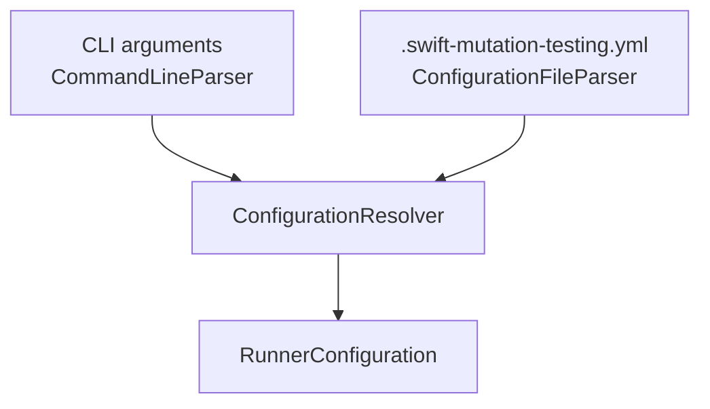
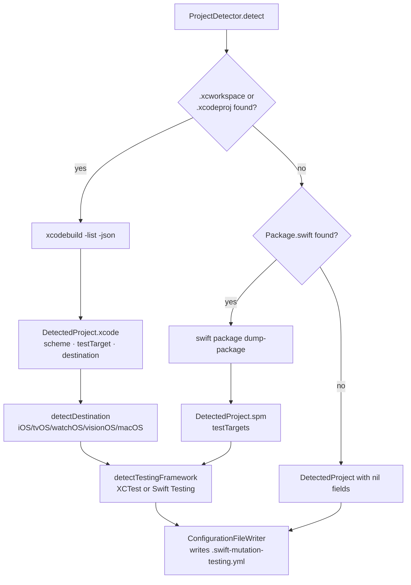

# Configuration

← [Execution Pipeline](03-execution.md) | Next: [Schematization →](05-schematization.md)

---

## Configuration File

`swift-mutation-testing` reads `.swift-mutation-testing.yml` from the project root. `ConfigurationFileParser` looks for the file at `<project-path>/.swift-mutation-testing.yml`. If the file is absent, all values default to their built-in defaults and required options must be supplied via CLI.

`swift-mutation-testing init` generates a starter configuration file by running `ProjectDetector` to auto-detect the project type, scheme, test targets, destination, and testing framework.

```yaml
scheme: MyApp
destination: platform=iOS Simulator,name=iPhone 16
# testTarget: MyAppTests
timeout: 60
# concurrency: 4
# noCache: true
# output: mutation-report.json
# htmlOutput: mutation-report.html
# sonarOutput: sonar-report.json
# sourcesPath: Sources/
# exclude:
#   - "**/Generated/**"

# Mutation operators — set active: false to disable
mutators:
  - name: RelationalOperatorReplacement
    active: true
  - name: BooleanLiteralReplacement
    active: true
  - name: LogicalOperatorReplacement
    active: true
  - name: ArithmeticOperatorReplacement
    active: true
  - name: NegateConditional
    active: true
  - name: SwapTernary
    active: true
  - name: RemoveSideEffects
    active: true
```

The `mutators:` block is the format generated by `init`. An alternative allowlist form is also supported:

```yaml
operators:
  - RelationalOperatorReplacement
  - BooleanLiteralReplacement
```

## Configuration Model

`RunnerConfiguration` is organized into three nested option groups:

```
RunnerConfiguration
├── projectPath           — absolute path to the project root
├── build: BuildOptions
│   ├── projectType       — ProjectType (.xcode(scheme:destination:) or .spm)
│   ├── testTarget        — optional test target filter
│   ├── timeout           — per-mutant test timeout (Xcode default: 120s, SPM default: 30s)
│   ├── concurrency       — parallel workers (default: ProcessInfo.processorCount - 1)
│   ├── noCache           — disable result caching (default: false)
│   ├── testingFramework  — TestingFramework (.xctest or .swiftTesting, default: .swiftTesting)
│   └── likelyKillerTests — source path → likely-killer test file names (config-file-only, default: [:])
├── reporting: ReportingOptions
│   ├── output            — path for JSON report (optional)
│   ├── htmlOutput        — path for HTML report (optional)
│   ├── sonarOutput       — path for Sonar report (optional)
│   └── quiet             — suppress progress output (default: false)
└── filter: FilterOptions
    ├── sourcesPath       — root directory for source file discovery (default: projectPath)
    ├── excludePatterns   — glob patterns for files to exclude
    ├── operators         — active mutation operator identifiers
    ├── scopeLines        — "path:start-end" line sets the run is limited to (CLI-only, default: [])
    ├── since             — git reference whose diff against the working tree limits the run (CLI-only)
    └── baselineReport    — earlier full run's report, read to find mutants a changed test killed (CLI-only)
```

`scopeLines`, `since`, and `baselineReport` feed `ScopeResolver`, which runs once before the discovery pipeline and produces the `MutantScope?` that limits which mutants discovery keeps — see [Discovery Pipeline § ScopeFilterStage](02-discovery.md#scopefilterstage) and its [CodeBase reference](../CodeBase/03-discovery-pipeline.md#scope-resolution).

### ProjectType

```swift
enum ProjectType: Sendable, Equatable {
    case xcode(scheme: String, destination: String)
    case spm
}
```

Xcode projects require a scheme and destination. SPM projects are detected automatically when a `Package.swift` exists and no `.xcodeproj` or `.xcworkspace` is found.

### TestingFramework

```swift
enum TestingFramework: String, Sendable {
    case xctest
    case swiftTesting = "swift-testing"
}
```

`ProjectDetector` automatically detects the testing framework by scanning test target source files for `import Testing` (Swift Testing) or `import XCTest` patterns. The detected framework influences test output parsing.

## CLI Arguments

All options correspond directly to `RunnerConfiguration` fields. CLI values override file values.

```
swift-mutation-testing [<project-path>] [options]
swift-mutation-testing [<project-path>] init

OPTIONS:
  --scheme <scheme>             Xcode scheme to build and test (required)
  --destination <destination>   xcodebuild destination specifier (required)
  --target <test-target>        Limit test execution to this target
  --timeout <seconds>           Per-mutant test timeout (default: 60)
  --build-timeout <seconds>     Bounds the schematized build only (default: 600)
  --concurrency <n>             Parallel workers (default: CPUs - 1)
  --no-cache                    Disable result caching
  --testing-framework <value>   Target's test framework: xctest or swift-testing
  --output <json-path>          Write JSON report to path
  --html-output <html-path>     Write HTML report to path
  --sonar-output <json-path>    Write Sonar report to path
  --quiet                       Suppress progress output
  --sources-path <path>         Root for Swift source discovery (default: project path)
  --exclude <pattern>           Exclude files matching pattern (repeatable)
  --operator <id>               Active mutation operator (repeatable, default: all)
  --disable-mutator <id>        Disable a mutation operator (repeatable)
  --scope-lines <path:start-end> Limit the run to these lines (repeatable)
  --since <git-ref>             Limit the run to the diff against this git reference
  --baseline-report <path>      Earlier full run's report, to re-test mutants a changed test killed
  --version                     Print version and exit
  --help                        Print usage and exit
```

`likely-killer-tests` (the source-to-test-file overrides `LikelyKillerTestMapping` and `LikelyKillerTestSelector` read) is configuration-file-only — there is no corresponding CLI flag.

## Resolution Order

`ConfigurationResolver` merges CLI arguments and file values. CLI always wins.



For Xcode projects, `scheme` and `destination` are required and throw `UsageError` if absent in both sources. SPM projects require neither — `ProjectType.spm` is used automatically. Optional fields fall back to their built-in defaults when absent in both.

## Project Detection

`ProjectDetector` auto-detects the project type, scheme, test targets, destination, and testing framework.



**Detection steps:**
1. `findContainer` — looks for `.xcworkspace` or `.xcodeproj` in the project directory
2. If found: `listProject` queries `xcodebuild -list` for schemes and test targets → `DetectedProject.xcode`
3. If not found: `listSPMTestTargets` queries `swift package dump-package` for test targets → `DetectedProject.spm`
4. `detectDestination` — scans project settings for platform SDKs (iOS, tvOS, watchOS, visionOS, macOS)
5. `detectTestingFramework` — scans test target source files for `import Testing` vs `import XCTest` to determine `TestingFramework`

`DetectedProject` carries the best-guess scheme (first scheme found), test targets, destination, and testing framework. Fields are `nil` when detection fails, producing a template file with placeholder comments.

## Mutation Operators Reference

| Identifier | Short description |
|---|---|
| `RelationalOperatorReplacement` | Replaces `>`, `>=`, `<`, `<=`, `==`, `!=` with their complements |
| `BooleanLiteralReplacement` | Flips `true` ↔ `false` |
| `LogicalOperatorReplacement` | Swaps `&&` ↔ `\|\|` |
| `ArithmeticOperatorReplacement` | Swaps `+` ↔ `-` and `*` ↔ `/` |
| `NegateConditional` | Wraps a condition in `!()` |
| `SwapTernary` | Swaps the true and false branches of a ternary |
| `RemoveSideEffects` | Removes standalone function call statements |

---

← [Execution Pipeline](03-execution.md) | Next: [Schematization →](05-schematization.md)
