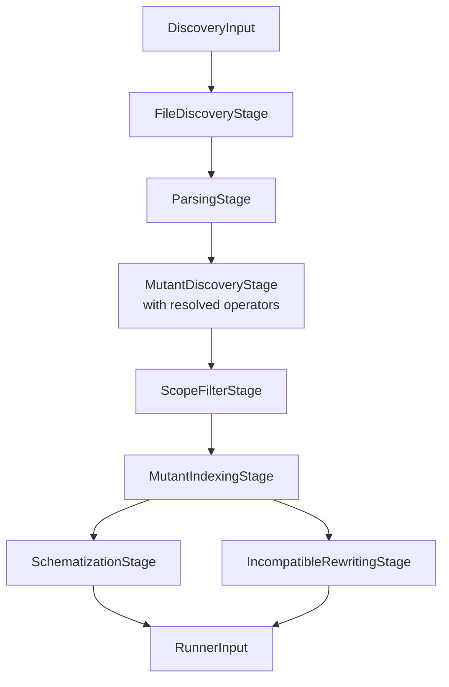
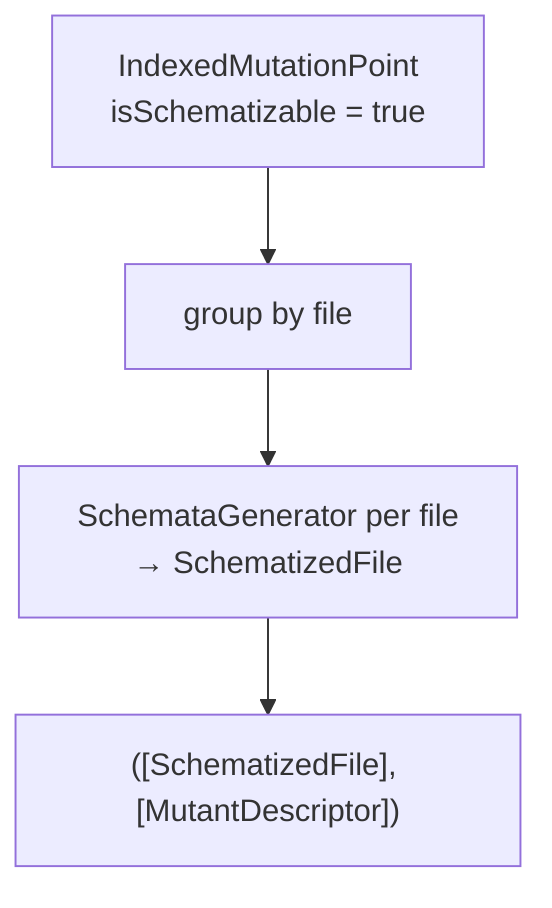

# Discovery Pipeline

← [Configuration](02-configuration.md) | Next: [Mutation Operators →](04-mutation-operators.md)

---

## Discovery/DiscoveryPipeline.swift

```swift
struct DiscoveryPipeline: Sendable {
    static let allOperatorNames: [String]
    func run(input: DiscoveryInput) async throws -> RunnerInput
}
```

Entry point for the discovery phase. Runs the stages below sequentially and assembles the `RunnerInput` for the execution pipeline.



`ScopeFilterStage` runs between mutant discovery and indexing so that a scoped run assigns IDs, schematizes, and builds only the mutants it will actually test — an unscoped run (`input.scope == nil`) passes every mutant through unchanged. See [Scope Resolution](#scope-resolution) below for where `DiscoveryInput.scope` comes from.

`allOperatorNames` is the ordered list of all registered operator identifiers. `ConfigurationFileWriter` uses it to populate the operators section of the generated YAML.

**Operator registry** (registration order is fixed):

| Index | Identifier |
|---|---|
| 0 | `RelationalOperatorReplacement` |
| 1 | `BooleanLiteralReplacement` |
| 2 | `LogicalOperatorReplacement` |
| 3 | `ArithmeticOperatorReplacement` |
| 4 | `NegateConditional` |
| 5 | `SwapTernary` |
| 6 | `RemoveSideEffects` |

When `input.operators` is empty, all seven operators are active. Otherwise only the listed identifiers are used.

---

## Discovery/Pipeline/DiscoveryInput.swift

```swift
struct DiscoveryInput: Sendable {
    let projectPath: String
    let projectType: ProjectType
    let timeout: Double
    let concurrency: Int
    let noCache: Bool
    let sourcesPath: String
    let excludePatterns: [String]
    let operators: [String]

    /// The lines this run tests, or nil when it tests every mutant it discovers.
    let scope: MutantScope?
}
```

| Field | Description |
|---|---|
| `projectPath` | Absolute path to the project root (Xcode or SPM) |
| `projectType` | `ProjectType` — `.xcode(scheme:destination:)` or `.spm` |
| `timeout` | Per-mutant test timeout in seconds |
| `concurrency` | Number of parallel test workers |
| `noCache` | Disable result cache |
| `sourcesPath` | Root directory for Swift source file collection |
| `excludePatterns` | Glob patterns for files to skip |
| `operators` | Active operator identifiers (empty = all) |
| `scope` | `MutantScope?` from `ScopeResolver`; `nil` for an unscoped run. `FileDiscoveryStage` uses it to skip reading files it covers no line of, and `ScopeFilterStage` uses it to drop out-of-scope mutation points |

---

## Discovery/Pipeline/FileDiscoveryStage.swift

```swift
struct FileDiscoveryStage: Sendable {
    func run(input: DiscoveryInput) throws -> [SourceFile]
}
```

Recursively enumerates the directory tree under `input.sourcesPath` using `FileManager.enumerator`. Returns one `SourceFile` per discovered `.swift` file.

**Exclusions:** every file is tested against `SourceFileExclusion(patterns: input.excludePatterns)` — see [Discovery/Pipeline/SourceFileExclusion.swift](#discoverypipelinesourcefileexclusionswift) below — and dropped if it matches.

**Scope:** when `input.scope` is non-nil, a file the scope covers no line of (`scope.covers(filePath:)`) is skipped without being read — a scoped run never pays to read or parse a file that could hold no in-scope mutant.

Throws `FileDiscoveryError.sourcesPathNotFound` if `sourcesPath` does not exist.

---

## Discovery/Pipeline/SourceFileExclusion.swift

```swift
struct SourceFileExclusion: Sendable {
    init(patterns: [String] = [])
    func excludes(path: String) -> Bool
}
```

The Swift files mutation testing leaves alone: the tests themselves, the doubles that support them, and anything a build produced. `FileDiscoveryStage` and `ScopeResolver`'s test-file classification (see [Scope Resolution](#scope-resolution)) both use it — which also makes this the rule that tells a changed test file from a changed source file when resolving scope.

**Test files** are whatever [`TestFileConvention.isTestFile(path:)`](09-reporting-infrastructure.md#infrastructuretestfileconventionswift) recognises — the tests themselves, the test-target directory heuristic, and test doubles. `TestFilesHasher` uses the same rule for cache invalidation, so discovery and the cache never disagree about which files carry mutants.

**Build output directories** (always applied, regardless of configured `--exclude` patterns): `/.build/`, `/.swift-mutation-testing-cache/`, `/DerivedData/`. These are a discovery-scope concern only — a build artifact is not a test file — so they live here rather than in `TestFileConvention`.

Configured `--exclude` patterns are matched last, anywhere in the path.

---

## Discovery/Pipeline/FileDiscoveryError.swift

```swift
enum FileDiscoveryError: Error, Sendable {
    case sourcesPathNotFound(String)
}
```

| Case | Payload | Condition |
|---|---|---|
| `sourcesPathNotFound` | `String` — the missing path | `sourcesPath` directory does not exist |

---

## Discovery/Pipeline/ParsingStage.swift

```swift
struct ParsingStage: Sendable {
    func run(sourceFiles: [SourceFile]) async -> [ParsedSource]
}
```

Parses each `SourceFile` into a SwiftSyntax AST using `withTaskGroup` for concurrency. Files that fail to parse are silently dropped. The output array contains only successfully parsed files.

---

## Discovery/Pipeline/MutantDiscoveryStage.swift

```swift
struct MutantDiscoveryStage: Sendable {
    init(operators: [any MutationOperator])
    func run(sources: [ParsedSource]) async -> [MutationPoint]
}
```

Applies all active operators concurrently across sources via `withTaskGroup`. For each source:

1. Extracts suppressed ranges via `SuppressionAnnotationExtractor`
2. Collects mutation points from every operator
3. Removes suppressed points via `SuppressionFilter`

Results are sorted by `filePath` then `utf8Offset`.

---

## Discovery/Pipeline/ScopeFilterStage.swift

```swift
struct ScopeFilterStage: Sendable {
    func run(mutationPoints: [MutationPoint], scope: MutantScope?) -> [MutationPoint]
}
```

Drops the mutants outside the run's scope, so that a scoped run schematizes, builds, and tests only the lines it was asked about. Runs between `MutantDiscoveryStage` and `MutantIndexingStage`, so IDs are assigned only to mutants that survive the filter.

`scope == nil` (unscoped run) is a pass-through — every discovered mutant keeps going. Otherwise keeps only mutation points where `scope.contains(filePath:line:)`.

See [Scope Resolution](#scope-resolution) below for how `scope` is built.

---

## Scope Resolution

The `Scope/` module builds the `MutantScope?` that `DiscoveryInput.scope` carries and `ScopeFilterStage` filters by. `ScopeResolver.resolve(configuration:)` is called once, before discovery starts (`SwiftMutationTesting.execute`), from the flags that name a scope: `--scope-lines`, `--since`, and `--baseline-report` (`RunnerConfiguration.FilterOptions` — see [Configuration](02-configuration.md)).

```mermaid
flowchart TD
    SL["--scope-lines"] --> SLSP[ScopeLineSpecParser]
    SI["--since <ref>"] --> GDR[GitDiffReader]
    GDR --> GDP[GitDiffParser]
    SLSP --> UNION1{union}
    GDP --> UNION1
    UNION1 --> TFS["testFileScope\n(test files the scope names)"]
    TFS --> LKM[LikelyKillerTestMapping\nsources the test covers]
    TFS -- --baseline-report --> BR[BaselineReport\nmutants that test used to kill]
    LKM --> UNION2{union}
    BR --> UNION2
    UNION1 --> UNION2
    UNION2 --> SCOPE[MutantScope]
```

### Scope/MutantScope.swift

```swift
struct MutantScope: Sendable, Equatable, CustomStringConvertible {
    init(lineRangesByPath: [String: [ClosedRange<Int>]])
    static let everyLine: ClosedRange<Int>
    var isEmpty: Bool
    var paths: [String]
    var description: String
    func covers(filePath: String) -> Bool
    func contains(filePath: String, line: Int) -> Bool
    func union(_ other: MutantScope) -> MutantScope
}
```

The source lines a run is limited to. A mutant is in scope when one of the scope's paths names its file and one of that path's ranges covers its line. Paths are normalized (`.` components and repeated separators collapsed) and matched as a trailing run of whole path components, so a scope path relative to the project (as a diff or `--scope-lines` writes it) matches the absolute path discovery knows the file by, and a bare file name matches that file wherever the project keeps it.

An unscoped run has no `MutantScope` at all (`DiscoveryInput.scope == nil`), so an *empty* scope means nothing is in scope rather than everything — the case where every scoping flag resolved to no lines at all.

### Scope/ScopeResolver.swift

```swift
struct ScopeResolver: Sendable {
    let launcher: any ProcessLaunching
    func resolve(configuration: RunnerConfiguration) async throws -> MutantScope?
}
```

Gathers the scope from `RunnerConfiguration.filter`: `ScopeLineSpecParser` for `--scope-lines`, unioned with `GitDiffParser`'s parse of the `GitDiffReader` diff for `--since`. Returns `nil` (unscoped) when neither flag was given; throws `UsageError` if `--baseline-report` was given without either.

Test files named by the resulting scope (`.swift` paths `SourceFileExclusion` classifies as tests) are expanded into the sources they cover, whole (via `LikelyKillerTestMapping`) — a test file itself carries no mutants, so a run scoped to a diff alone would pass a test-only change without having tested anything. Where `--baseline-report` is also given, each such test additionally puts back in scope every mutant an earlier full run's report says that test used to kill, wherever it lives (`BaselineReport.scope(killedByTestsIn:)`) — those mutants would otherwise be judged only by the lines of the test itself, which carry none.

### Scope/ScopeLineSpecParser.swift

```swift
struct ScopeLineSpecParser: Sendable {
    func parse(_ specs: [String]) throws -> MutantScope
}
```

Reads the `path:start-end` line sets `--scope-lines` takes (path taken up to the *last* colon, so a path containing one is still read whole). Throws `UsageError` for a malformed spec.

### Scope/GitDiffReader.swift

```swift
struct GitDiffReader: Sendable {
    static let timeout: Double
    let launcher: any ProcessLaunching
    func diff(since ref: String, projectPath: String) async throws -> String
}
```

Runs `git diff -U0 --relative <ref>` in the project directory (relative, so a package nested in a larger repository is scoped by its own changes only) and returns its raw output. Throws `UsageError` if the process fails or exits non-zero.

### Scope/GitDiffParser.swift

```swift
struct GitDiffParser: Sendable {
    func parse(_ diff: String) -> MutantScope
}
```

Turns the zero-context (`-U0`) diff `GitDiffReader` returns into a `MutantScope` covering the lines each hunk left changed on its new side. A file the diff deletes goes into the scope whole (`MutantScope.everyLine`) — it has no lines left to mutate, but a deleted test file still has to put the source it covered back in scope. Handles git's C-quoting of paths containing quotes, backslashes, control characters, or non-ASCII bytes.

### Scope/BaselineReport.swift

```swift
struct BaselineReport: Sendable {
    init(path: String) throws
    func scope(killedByTestsIn changedTestFilePaths: [String]) -> MutantScope
}
```

Reads a mutation report JSON from an earlier full run (the same `MutationReportPayload` shape `JsonReporter` writes — see [Reporting & Infrastructure](09-reporting-infrastructure.md)). `scope(killedByTestsIn:)` returns, one line at a time (each killed mutant's own reported line, not the whole file), every mutant the report records as killed by a test one of the given test files declares, so a scoped run also re-tests the mutants a weakened version of that test used to catch — wherever they live, since the mutant's own line is put in scope regardless of which file it's in.

---

## Discovery/Pipeline/MutantIndexingStage.swift

```swift
struct MutantIndexingStage: Sendable {
    func run(mutationPoints: [MutationPoint], sources: [ParsedSource]) -> [IndexedMutationPoint]
}
```

Assigns a globally unique sequential index to each mutation point (sorted by file path, then UTF-8 offset) and classifies them as schematizable or incompatible using `TypeScopeVisitor`. The index becomes the mutant ID suffix in `"swift-mutation-testing_<index>"`.

---

## Discovery/Pipeline/IndexedMutationPoint.swift

```swift
struct IndexedMutationPoint: Sendable {
    let point: MutationPoint
    let id: String
    let isSchematizable: Bool
}
```

| Field | Description |
|---|---|
| `point` | The original mutation point |
| `id` | `"swift-mutation-testing_<index>"` — unique per run |
| `isSchematizable` | `true` if the mutation falls inside a function body (determined by `TypeScopeVisitor`) |

---

## Discovery/Pipeline/SchematizationStage.swift

```swift
struct SchematizationStage: Sendable {
    static let supportFileContent: String
    func run(indexed: [IndexedMutationPoint], sources: [ParsedSource]) -> ([SchematizedFile], [MutantDescriptor])
}
```

Embeds all schematizable mutations into the source files via `SchemataGenerator`. Returns a tuple of schematized files and schematizable mutant descriptors.



The static `supportFileContent` declares `__swiftMutationTestingID` as a computed property reading from `ProcessInfo.processInfo.environment["__SWIFT_MUTATION_TESTING_ACTIVE"]`.

---

## Discovery/Pipeline/IncompatibleRewritingStage.swift

```swift
struct IncompatibleRewritingStage: Sendable {
    func run(indexed: [IndexedMutationPoint], sources: [ParsedSource]) -> [MutantDescriptor]
}
```

Produces full-file rewrites for mutants that cannot be schematized. Each incompatible mutation point is applied to the source via `MutationRewriter`, producing a complete replacement source file stored in `MutantDescriptor.mutatedSourceContent`.

---

## Discovery/Pipeline/SourceFile.swift

```swift
struct SourceFile: Sendable {
    let path: String
    let content: String
}
```

| Field | Description |
|---|---|
| `path` | Absolute path to the `.swift` file |
| `content` | Raw UTF-8 source text |

---

## Discovery/Pipeline/ParsedSource.swift

```swift
struct ParsedSource: Sendable {
    let file: SourceFile
    let syntax: SourceFileSyntax
}
```

| Field | Description |
|---|---|
| `file` | The source file with its raw text |
| `syntax` | SwiftSyntax AST root node |

---

## Discovery/Pipeline/MutationPoint.swift

```swift
struct MutationPoint: Sendable {
    let filePath: String
    let line: Int
    let column: Int
    let utf8Offset: Int
    let originalText: String
    let mutatedText: String
    let operatorIdentifier: String
    let replacement: ReplacementKind
    var description: String { get }
}
```

Represents a single applicable mutation before schematization.

| Field | Description |
|---|---|
| `filePath` | Absolute path to the source file |
| `line` | 1-based line number |
| `column` | 1-based column number |
| `utf8Offset` | Byte offset in UTF-8 encoded content |
| `originalText` | Token(s) before mutation |
| `mutatedText` | Token(s) after mutation |
| `operatorIdentifier` | Name of the operator that produced this point |
| `replacement` | Structural kind of the replacement |
| `description` | Computed: `"\(originalText) → \(mutatedText)"` |

---

## Discovery/Pipeline/MutantDescriptor.swift

```swift
struct MutantDescriptor: Sendable, Codable {
    let id: String
    let filePath: String
    let line: Int
    let column: Int
    let utf8Offset: Int
    let originalText: String
    let mutatedText: String
    let operatorIdentifier: String
    let replacementKind: ReplacementKind
    let description: String
    let isSchematizable: Bool
    let mutatedSourceContent: String?
}
```

The canonical representation of a mutant carried through the execution pipeline and into reports.

| Field | Description |
|---|---|
| `id` | `"swift-mutation-testing_<index>"` — unique per run |
| `isSchematizable` | `true` if the mutation falls inside a function body |
| `mutatedSourceContent` | Complete source file with the mutation applied; `nil` for schematizable mutants |

All position fields (`line`, `column`, `utf8Offset`) match those in the originating `MutationPoint`.

---

← [Configuration](02-configuration.md) | Next: [Mutation Operators →](04-mutation-operators.md)
