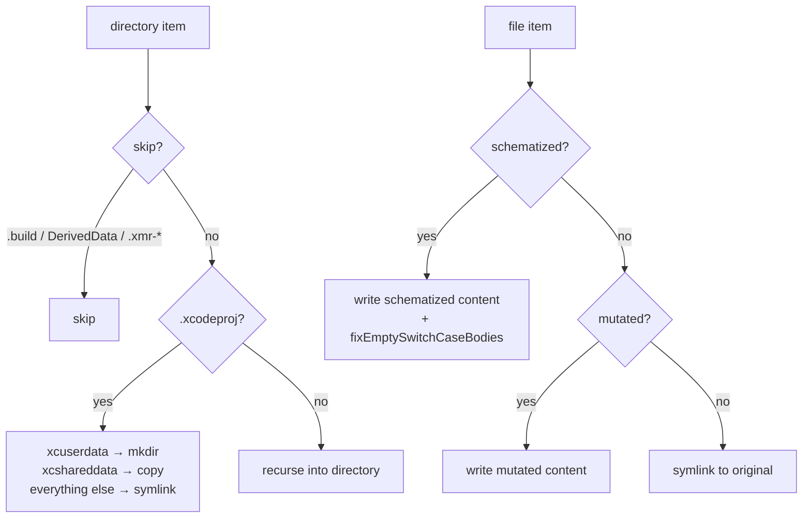

# Sandbox & Build

← [Schematization](05-schematization.md) | Next: [Execution →](07-execution.md)

---

## Sandbox/SandboxFactory.swift

```swift
struct SandboxFactory: Sendable {
    func create(
        projectPath: String,
        schematizedFiles: [SchematizedFile],
        supportFileContent: String
    ) async throws -> Sandbox

    func createClean(
        projectPath: String
    ) async throws -> Sandbox

    func create(
        projectPath: String,
        mutatedFilePath: String,
        mutatedContent: String
    ) async throws -> Sandbox
}
```

Creates an isolated copy of the project in `$TMPDIR/xmr-<UUID>/`. Supports both Xcode and SPM projects. The original project is never modified.

Every sandbox root is created under [`SandboxDirectoryLock`](#sandboxsandboxdirectorylockswift) and records the creating process id in `.owner-pid`, which is how `SandboxCleaner.removeOrphaned` tells a live run's sandbox from an abandoned one.

**Factory methods:**

| Method | Used by | Description |
|---|---|---|
| `create(projectPath:schematizedFiles:supportFileContent:)` | `MutantExecutor` for schematizable path | Embeds all schematized files; injects support file; disables SwiftLint phases |
| `createClean(projectPath:)` | `IncompatibleMutantExecutor` for SPM shared sandbox | Clean sandbox without mutations; mutated files are written directly later |
| `create(projectPath:mutatedFilePath:mutatedContent:)` | `IncompatibleMutantExecutor` for Xcode path | Writes a single mutated file; no support file injection |
| `replicate(_:)` | `MutantExecutor` for every SPM worker after the first | Copies an already-built sandbox — build products included — into a fresh root with its own `.owner-pid`; symlinked project files stay symlinks |

`replicate` gives each worker a working directory and a build directory no other worker touches. It does not isolate *linked* products: SwiftPM bakes an absolute rpath into the test bundle, so frameworks a bundle links dynamically still load from the sandbox that built them. That is harmless — the code is identical and the mutant is selected at runtime through `__SWIFT_MUTATION_TESTING_ACTIVE`.

A run replicates `max(1, min(concurrency, testable schematizable mutants)) − 1` times. Copying a build directory for a worker that has no mutant to run is pure cost, which a diff-scoped run of a handful of mutants on a many-core machine would otherwise pay once per core.

**Copy strategy:**



**Post-processing steps (schematizable overload only):**

1. `injectSupportFile` — writes `__SMTSupport.swift` to the sandbox `Sources/` directory (or appends to the first schematized file if no `Sources/` directory exists). When the destination is an Xcode target (not macOS/SPM), transforms the computed property form to a `nonisolated(unsafe)` stored variable.

2. `disableSwiftLintBuildPhases` — patches `project.pbxproj`, replacing the `shellScript` of every `PBXShellScriptBuildPhase` that contains `swiftlint` with `exit 0\n`.

3. `fixEmptySwitchCaseBodies` — post-processes each schematized file after writing. Inserts a `break` statement into any `case "..."` block immediately followed by another case or default, preventing Swift compiler errors when `RemoveSideEffects` removes the only statement in a function body.

---

## Sandbox/Sandbox.swift

```swift
struct Sandbox: Sendable {
    let rootURL: URL
    func cleanup() throws
}
```

A lightweight wrapper around the sandbox root URL.

| Field | Description |
|---|---|
| `rootURL` | Absolute URL of the `xmr-<UUID>` directory in `$TMPDIR` |

`cleanup()` removes the entire `rootURL` directory tree via `FileManager.default.removeItem(at:)`.

---

## Sandbox/SandboxCleaner.swift

```swift
enum SandboxCleaner {
    static func removeOrphaned(in directory: URL = FileManager.default.temporaryDirectory)
    static func register(_ sandbox: Sandbox)
    static func deregister()
    static func installSignalHandlers()
    static func cleanUpOnSignalNotification(from descriptor: Int32)
}
```

Handles cleanup of orphaned and active sandbox directories.

| Method | Description |
|---|---|
| `removeOrphaned(in:)` | Scans the directory for `xmr-*` entries and removes those whose `.owner-pid` names a process that is no longer running. Called once at startup to clean up sandboxes from interrupted runs, leaving concurrent runs' sandboxes intact. An entry with no readable pid record is treated as orphaned |
| `register(_:)` | Adds the sandbox root to the registry the signal cleanup removes |
| `deregister()` | Empties the registry without removing anything, for sandboxes the run has already cleaned up itself |
| `installSignalHandlers()` | Creates the notification pipe, starts the watcher thread and installs `SIGINT`/`SIGTERM` handlers; a repeat call keeps what is already in place |
| `cleanUpOnSignalNotification(from:)` | The watcher loop: blocks on the pipe, then removes the active sandboxes and calls `_exit(1)` in ordinary context |

The registry is a `nonisolated(unsafe)` module-scope array of sandbox roots — module scope because C signal handlers cannot capture Swift context — and every access goes through an `NSLock`. The signal handler never takes that lock and never touches the array: it writes a single byte to a self-pipe, which is async-signal-safe, and the watcher thread reading the pipe does the `FileManager` work. `register`/`deregister` are called from `MutantExecutor.execute`, and the watcher can run at any moment, so the lock is what keeps a signal arriving mid-registration from tearing the array.

---

## Sandbox/SandboxDirectoryLock.swift

```swift
enum SandboxDirectoryLock {
    static let fileName = ".swift-mutation-testing-sandbox.lock"
    struct AcquisitionFailed: Error {}
    static func withExclusiveLock<T>(in directory: URL, _ body: () throws -> T) throws -> T
}
```

Interprocess exclusive lock serializing sandbox creation against the orphan sweep. A sandbox directory exists briefly before its `.owner-pid` file is written; a sweep enumerating during that window would see an unowned directory and delete a live run's sandbox. `SandboxFactory.makeSandboxRoot` holds the lock from directory creation through the pid write, and `SandboxCleaner.removeOrphaned` holds it across enumeration, liveness checks and deletion.

The lock is an advisory `flock(2)` on `$TMPDIR/.swift-mutation-testing-sandbox.lock` — beside the sandboxes, never inside one. The kernel releases it when the holding process exits, so a crashed run cannot strand it. If the lock file cannot be opened, or the `flock(2)` call itself fails for a non-retryable reason, `withExclusiveLock` throws `AcquisitionFailed` rather than running unlocked — running unlocked would reopen the exact race this lock exists to close. `makeSandboxRoot` propagates that error (sandbox creation fails outright); `removeOrphaned` is nonthrowing and catches it to skip that sweep pass.

---

## Build/BuildStage.swift

```swift
struct BuildStage: Sendable {
    let launcher: any ProcessLaunching

    func build(
        sandbox: Sandbox,
        scheme: String,
        destination: String,
        timeout: Double
    ) async throws -> BuildArtifact

    func buildSPM(
        sandbox: Sandbox,
        timeout: Double
    ) async throws -> BuildArtifact
}
```

Runs a single build inside the sandbox.

**Xcode path (`build`):**

```mermaid
flowchart TD
    A[xcodebuild build-for-testing\n-scheme -destination\n-derivedDataPath sandbox/.xmr-derived-data] --> B{exit code?}
    B -- non-zero --> FAIL[throw BuildError.compilationFailed]
    B -- 0 --> C[search Build/Products for .xctestrun]
    C -- not found --> NFE[throw BuildError.xctestrunNotFound]
    C -- found --> D[Data(contentsOf: xctestrunURL)]
    D --> E[XCTestRunPlist(data)]
    E -- nil --> NFE2[throw BuildError.xctestrunNotFound]
    E -- plist --> F[BuildArtifact]
```

Auto-detects project format: prefers `-workspace` if a `.xcworkspace` exists, falls back to `-project` for `.xcodeproj`.

**SPM path (`buildSPM`):** Runs `swift build --build-tests` in the sandbox directory, then lists the `.xctest` bundles SwiftPM linked into `.build/debug` (resolving that symlink, which directory enumeration does not follow). Returns a `BuildArtifact` carrying those bundle paths relative to the sandbox root; a build that produces no bundle throws `BuildError.testBundleNotFound`.

Derived data is placed at `<sandbox>/.xmr-derived-data` to keep it inside the sandbox directory.

---

## Build/BuildArtifact.swift

```swift
struct BuildArtifact: Sendable {
    let derivedDataPath: String
    let xctestrunURL: URL?
    let plist: XCTestRunPlist?
    let testBundlePaths: [String]
}
```

| Field | Description |
|---|---|
| `derivedDataPath` | Path passed to `-derivedDataPath`; reused by `test-without-building` |
| `xctestrunURL` | URL of the `.xctestrun` file in `Build/Products` (Xcode only) |
| `plist` | Parsed representation of the `.xctestrun` plist (Xcode only) |
| `testBundlePaths` | `.xctest` bundles built by SPM, relative to the sandbox root so a worker resolves them inside its own copy; empty for Xcode |

---

## Build/BuildError.swift

```swift
enum BuildError: Error, Equatable, LocalizedError {
    case compilationFailed(output: String)
    case xctestrunNotFound
    case testBundleNotFound
    case testTargetUnscopable(testTarget: String)

    var errorDescription: String? { get }
}
```

Conforms to `LocalizedError` to provide structured error descriptions that propagate through generic `catch` blocks.

| Case | Condition | Handling |
|---|---|---|
| `compilationFailed(output:)` | Build exits with non-zero code | Caught by `MutantExecutor`; triggers `FallbackExecutor` |
| `xctestrunNotFound` | No `.xctestrun` in `Build/Products`, or plist parse failure | Propagates; fatal |
| `testBundleNotFound` | No `.xctest` bundle found after an SPM build | Propagates; fatal |
| `testTargetUnscopable(testTarget:)` | A configured `--target` matched no test bundle — the SwiftPM toolchain merged every test target into one bundle, leaving nothing narrower to select | Propagates; fatal — see [Execution § BundleSelection](07-execution.md) |

---

← [Schematization](05-schematization.md) | Next: [Execution →](07-execution.md)
