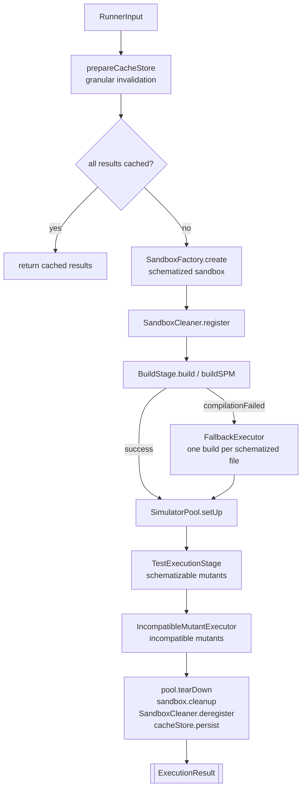
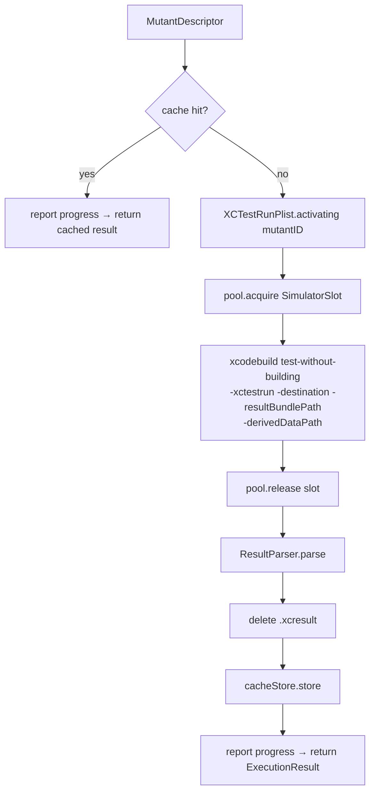
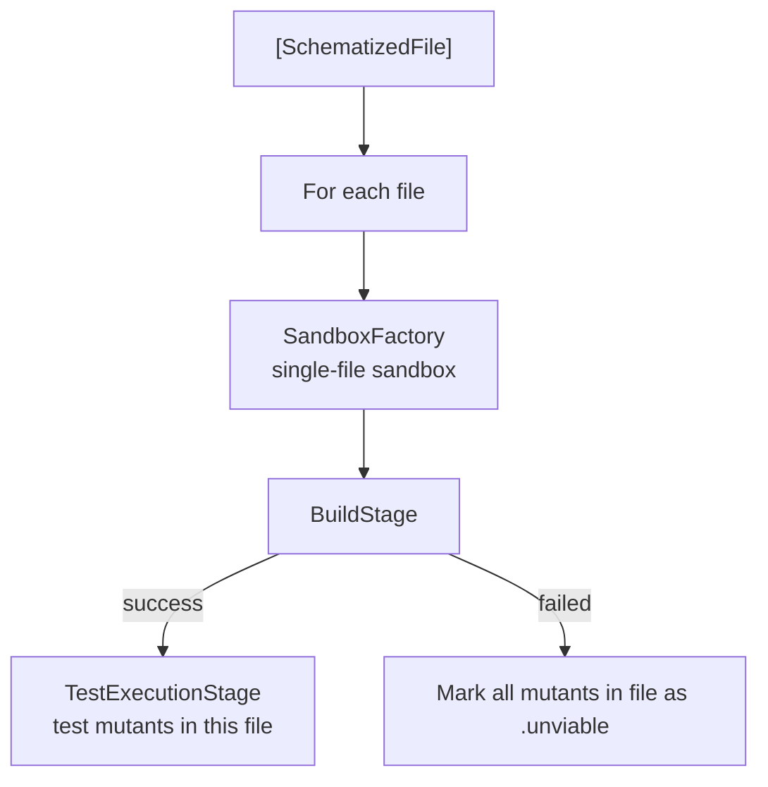
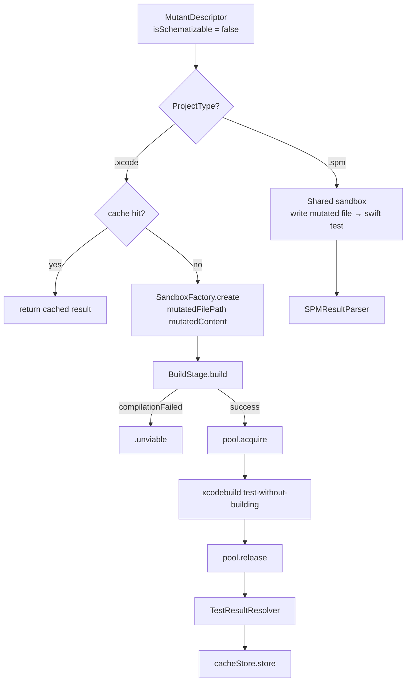

# Execution

← [Sandbox & Build](06-sandbox-build.md) | Next: [Result Parsing & Cache →](08-result-parsing-cache.md)

---

## Execution/MutantExecutor.swift

```swift
struct MutantExecutor: Sendable {
    init(configuration: RunnerConfiguration, launcher: any ProcessLaunching)
    func execute(_ input: RunnerInput) async throws -> [ExecutionResult]
}
```

Entry point for the execution pipeline. Orchestrates sandbox creation, build, simulator pool setup, and test execution for both schematizable and incompatible mutants. Supports both Xcode and SPM project types.



**Normal path:** builds once, and for SPM runs `BaselineRunner` over the built bundles with no mutant selected before running `TestExecutionStage` for all schematizable mutants in parallel. A failing baseline ends the run; a passing one sets the scale every mutant's timeout is measured on.

**Fallback path:** triggered when `BuildStage` throws `compilationFailed`. Delegates to `FallbackExecutor`, which rebuilds one schematized file at a time. Mutants in files that still fail to compile are marked `.unviable`.

**Incompatible path:** always runs after the schematizable path. Delegates to `IncompatibleMutantExecutor`.

---

## Execution/ExecutionDeps.swift

```swift
struct ExecutionDeps: Sendable {
    let launcher: any ProcessLaunching
    let cacheStore: CacheStore
    let reporter: any ProgressReporter
    let counter: MutationCounter
    let killerTestFileResolver: KillerTestFileResolver
    let likelyKillerTestSelector: LikelyKillerTestSelector
}
```

Bundle of shared collaborators passed between `MutantExecutor` and the stage types. Avoids threading individual dependencies through every call site.

| Field | Description |
|---|---|
| `launcher` | Process runner used for all `xcodebuild` invocations |
| `cacheStore` | Shared actor for reading and writing result cache entries |
| `reporter` | Progress events sink (console or silent) |
| `counter` | Shared actor tracking the current mutant index |
| `killerTestFileResolver` | Maps killer test names to source file paths for granular cache invalidation |
| `likelyKillerTestSelector` | Maps a mutated source file to the tests most likely to kill its mutants |

---

## Execution/LikelyKillerTestMapping.swift

```swift
struct LikelyKillerTestMapping: Sendable {
    let overrides: [String: [String]]

    func conventionalTestFileName(forSourceFile sourceFilePath: String) -> String
    func overriddenTestFileNames(forSourceFile sourceFilePath: String) -> [String]?
    func sourceFilePaths(forTestFile testFilePath: String) -> [String]
}
```

The pairing between a source file and the test files most likely to kill its mutants: the `Foo.swift` → `FooTests.swift` naming convention, plus the configured `likelyKillerTests` overrides for sources the convention does not cover. Read forwards (`conventionalTestFileName`/`overriddenTestFileNames`) by `LikelyKillerTestSelector` to choose the tests to run first against a mutant, and backwards (`sourceFilePaths(forTestFile:)`) by `ScopeResolver` to decide which sources a changed test file puts in scope — see [Discovery Pipeline § Scope Resolution](03-discovery-pipeline.md#scope-resolution).

| Method | Description |
|---|---|
| `conventionalTestFileName(forSourceFile:)` | The `FooTests.swift` name the convention pairs with a source, whether or not the project actually contains such a file |
| `overriddenTestFileNames(forSourceFile:)` | The configured `overrides` entry whose key is the longest suffix match of the source path, so a directory-scoped override beats a bare-file-name one; `nil` if no key matches |
| `sourceFilePaths(forTestFile:)` | Sources a test file is the likely killer for, read backwards: the convention's bare source file name, derived unconditionally by stripping the `Tests.swift` suffix, plus every `overrides` key whose value names that test file (matched by file name or by class name) |

Backwards, a source is offered whenever *either* rule pairs it with the test — a scope that misses a source lets a weakened test pass unexamined, while one that includes a source too many only runs mutants that would have run anyway.

---

## Execution/LikelyKillerTestSelector.swift

```swift
struct LikelyKillerTestSelector: Sendable {
    init(testFilePaths: [String], overrides: [String: [String]])

    func selection(forSourceFile sourceFilePath: String) -> String?
}
```

Names the tests an SPM mutant runs before the whole suite. `Foo.swift` is covered by
`FooTests.swift` unless `likely-killer-tests` in the configuration file maps that source onto
other test files (both resolved via `LikelyKillerTestMapping`, held privately); the result is the
XCTest selection naming those test classes. Configured override names are used as provided,
without checking that they exist or declare an `XCTestCase` subclass; the result is `nil` only
when there is no override and no reachable conventional match, leaving only the whole suite to
judge the mutant.

| Parameter | Description |
|---|---|
| `testFilePaths` | Every test file collected from the project. Read once at init to build the XCTest filter: conventional matches are kept only when they pass the `XCTestCase` check; configured override names bypass this filter and are used as provided |
| `overrides` | Configured test files per source path suffix, forwarded to the `LikelyKillerTestMapping` the selector holds internally; not a stored property on the selector itself |

---

## Execution/TestExecutionStage.swift

```swift
struct TestExecutionStage: Sendable {
    let deps: ExecutionDeps

    func execute(
        mutants: [MutantDescriptor],
        in context: TestExecutionContext
    ) async throws -> [ExecutionResult]
}
```

Runs `xcodebuild test-without-building` for each mutant in parallel via `withThrowingTaskGroup`. Maintains exactly `concurrency` active tasks at all times using a dynamic refill strategy.

**Per-mutant flow:**



A fresh `.xctestrun` file is written for each mutant (UUID-named, deleted after launch). The `.xcresult` bundle is deleted after `ResultParser` extracts failure details.

---

## Execution/TestExecutionContext.swift

```swift
struct TestExecutionContext: Sendable {
    let artifact: BuildArtifact
    let sandboxes: [Sandbox]
    let pool: SimulatorPool
    let configuration: RunnerConfiguration
    var baseline: BaselineMeasurement?

    func sandbox(forWorker worker: Int) -> Sandbox
}
```

Bundles the execution-time dependencies required by `TestExecutionStage` and the fallback path.

| Field | Description |
|---|---|
| `artifact` | Build output containing the `.xctestrun` plist (Xcode) or the built `.xctest` bundle paths (SPM) |
| `sandboxes` | One sandbox per worker; `sandbox(forWorker:)` hands each worker its own, wrapping when a caller supplies fewer sandboxes than workers |
| `pool` | Simulator slot pool for acquiring/releasing parallel slots |
| `configuration` | Full runner configuration (timeout, concurrency, testTarget, etc.) |
| `baseline` | What the unmutated suite measured, which each mutant's timeout is derived from; `nil` where none was measured |

---

## Execution/BundleSelection.swift

```swift
struct BundleSelection: Sendable {
    let paths: [String]
    let xctestSelection: String?

    static func resolve(artifact: BuildArtifact, testTarget: String?) throws -> BundleSelection
}
```

What a configured test target selects in a build's output: the bundle its first path component
names, and any remaining `Class/method` component as an `-XCTest` selection. An SPM target matching
no bundle throws `BuildError.testTargetUnscopable` — the toolchain merged every test target into one
bundle and there is nothing narrower to select, and running every bundle instead can change a
mutant's verdict, not just its runtime. Both the baseline run and each mutant's run resolve through
it, so they run the same tests.

---

## Execution/BaselineRunner.swift

```swift
struct BaselineRunner: Sendable {
    let launcher: any ProcessLaunching

    func measure(
        selection: BundleSelection,
        sandbox: Sandbox,
        timeout: Double
    ) async throws -> BaselineMeasurement
}
```

Runs an SPM run's bundles once with no mutant selected, before any mutant runs. Bundles run in turn
and stop at the first that exits non-zero; `BaselineOutputParser` then reads the run's per-test
durations and any failing test out of the output.

A suite that fails unmutated fails again under every mutant and reports every one of them killed, so
the run ends here with a `BaselineError`:

| Case | When |
|---|---|
| `testsFailed(tests:)` | The output named tests that failed |
| `didNotFinish(seconds:)` | The run was killed by the timeout (exit code `-1`) |
| `runFailed(output:)` | The run died non-zero without naming a failing test |

---

## Execution/BaselineMeasurement.swift

```swift
struct BaselineMeasurement: Sendable {
    let totalDuration: Double
    let testDurations: [String: Double]

    func duration(ofSelection selection: String?) -> Double
}
```

What the unmutated suite cost: the whole run's wall clock, and each test's own duration keyed
`Class/method` — the way an XCTest selection names it, without the module prefix XCTest prints.
`duration(ofSelection:)` sums the tests a selection names; a `nil` selection, and one no measured
test matched, both measure the whole run.

---

## Execution/MutantTimeout.swift

```swift
struct MutantTimeout: Sendable {
    static let baselineCoefficient: Double = 5

    let baseline: BaselineMeasurement?
    let configuredTimeout: Double

    func seconds(forSelection selection: String?) -> Double
}
```

How long a run of the tests a selection names may take: `baselineCoefficient` times what those
tests took unmutated, or `configuredTimeout`, whichever is longer — and `configuredTimeout` alone
where no baseline was measured. The configured `--timeout` is the floor and never the ceiling: a
mutation can legitimately slow code down by more than any multiple of a fast suite, and a run cut
short that way is reported as a timeout, which counts as caught and flatters the score.

---

## Execution/TestLaunchResult.swift

```swift
struct TestLaunchResult: Sendable {
    let exitCode: Int32
    let output: String
    let xcresultPath: String
    let duration: Double
    let stoppedAtFirstFailure: Bool
}
```

Raw result from a single `xcodebuild test-without-building` invocation.

| Field | Description |
|---|---|
| `exitCode` | Process exit code; `-1` means killed by timeout |
| `output` | Combined stdout + stderr |
| `xcresultPath` | Absolute path to the `.xcresult` bundle |
| `duration` | Wall-clock seconds from launch to termination |

---

## Execution/FallbackExecutor.swift

```swift
struct FallbackExecutor: Sendable {
    let deps: ExecutionDeps
    let configuration: RunnerConfiguration

    func execute(
        input: RunnerInput,
        mutants: [MutantDescriptor],
        pool: SimulatorPool
    ) async throws -> [ExecutionResult]
}
```

When the baseline build for all schematized files fails (`BuildError.compilationFailed`), `MutantExecutor` delegates to `FallbackExecutor`. This executor rebuilds one schematized file at a time.

`mutants` is the set to test, not `input.mutants`: mutants the schema build had to exclude are rerouted to `IncompatibleMutantExecutor`, and testing them here too would report them twice.



For each schematized file, creates a sandbox containing only that file's schematization, builds it (Xcode or SPM), and runs the test suite against its mutants. Files whose builds fail have all their mutants marked as `.unviable`. Results are cached via `CacheStore`.

---

## Execution/IncompatibleMutantExecutor.swift

```swift
struct IncompatibleMutantExecutor: Sendable {
    let deps: ExecutionDeps
    let sandboxFactory: SandboxFactory

    func execute(
        _ mutants: [MutantDescriptor],
        configuration: RunnerConfiguration,
        pool: SimulatorPool
    ) async throws -> [ExecutionResult]
}
```

Handles mutants that cannot be schematized. Behaviour differs by project type.

**Xcode path:** Each mutant creates its own sandbox via `SandboxFactory.create(projectPath:mutatedFilePath:mutatedContent:)`. Runs sequentially with a full build + test cycle per mutant.



**SPM path:** Uses a shared sandbox created via `SandboxFactory.createClean(projectPath:)`. For each mutant, writes the mutated source content (`mutant.mutatedSourceContent!`) directly to the sandbox, runs `swift test`, and restores the original file. Pipeline invariants guarantee `mutatedSourceContent` is always non-nil for incompatible mutants.

---

## Simulator/SimulatorPool.swift

```swift
actor SimulatorPool {
    init(baseUDID: String?, size: Int, destination: String, launcher: any ProcessLaunching)
    var size: Int { get }
    func setUp() async throws
    func acquire() async throws -> SimulatorSlot
    func release(_ slot: SimulatorSlot) async
    func tearDown() async
}
```

Manages a fixed-size pool of simulator slots for parallel test execution.

| Destination | `setUp` behaviour | `tearDown` behaviour |
|---|---|---|
| `platform=macOS` | Creates `size` no-op slots (no UDID) | No-op |
| iOS / tvOS / watchOS | Clones the base simulator `size` times; boots each clone | Shuts down and deletes each clone |

When a clone fails, `setUp` still waits for the remaining clone workers and records every
simulator that was created before rethrowing, so `tearDown` deletes them instead of leaking them.

`acquire()` returns an available slot immediately or suspends the caller until one is released. The suspension is wrapped with `withTaskCancellationHandler` — if the owning task is cancelled, the slot is released to prevent permanent deadlock.

`release(_:)` resumes the oldest pending `acquire()` waiter, or returns the slot to the available pool if no waiters exist.

---

## Simulator/SimulatorSlot.swift

```swift
struct SimulatorSlot: Sendable {
    let udid: String?
    let destination: String
}
```

| Field | Description |
|---|---|
| `udid` | Clone UDID for iOS/tvOS/watchOS slots; `nil` for macOS |
| `destination` | The destination string passed to `xcodebuild` for this slot |

---

## Simulator/SimulatorManager.swift

```swift
struct SimulatorManager: Sendable {
    init(launcher: any ProcessLaunching)
    static func requiresSimulatorPool(for destination: String) -> Bool
    func resolveBaseUDID(for destination: String) async throws -> String
    func waitForBooted(udid: String) async throws
}
```

Provides simulator lifecycle utilities.

`requiresSimulatorPool(for:)` returns `false` when the destination contains `platform=macOS`; `true` otherwise.

`resolveBaseUDID(for:)` parses `id=<udid>` or `name=<name>` from the destination string, then queries `xcrun simctl list devices` to resolve and validate the UDID.

`waitForBooted(udid:)` polls `xcrun simctl list devices` up to 60 times at 500 ms intervals until the simulator state is `Booted`. Throws `SimulatorError.bootTimeout` if not booted within 30 seconds.

---

## Simulator/SimulatorError.swift

```swift
enum SimulatorError: Error, LocalizedError {
    case deviceNotFound(destination: String)
    case bootTimeout(udid: String)
    case cloneFailed(udid: String)

    var errorDescription: String? { get }
}
```

Conforms to `LocalizedError` to provide structured error descriptions that propagate through generic `catch` blocks.

| Case | Condition |
|---|---|
| `deviceNotFound` | No simulator matching the destination string |
| `bootTimeout` | Simulator did not reach `Booted` state within the polling window |
| `cloneFailed` | `xcrun simctl clone` returned a non-zero exit code |

---

## Execution/MutationCounter.swift

```swift
actor MutationCounter {
    init(total: Int)
    nonisolated let total: Int
    func increment() -> Int
}
```

Tracks execution progress across concurrent tasks. `total` is set once at construction and accessed without actor isolation. `increment()` returns the new index after incrementing (1-based), used to format `"<index>/<total>"` progress lines.

---

## Execution/RunnerInput.swift

```swift
struct RunnerInput: Sendable {
    let projectPath: String
    let projectType: ProjectType
    let timeout: Double
    let concurrency: Int
    let noCache: Bool
    let schematizedFiles: [SchematizedFile]
    let supportFileContent: String
    let mutants: [MutantDescriptor]
}
```

The value produced by `DiscoveryPipeline` and consumed by `MutantExecutor`.

| Field | Description |
|---|---|
| `schematizedFiles` | One entry per source file containing schematizable mutations |
| `supportFileContent` | `__swiftMutationTestingID` global declaration for injection |
| `mutants` | All mutants, sorted by global index; `isSchematizable` distinguishes the two populations |

---

## Execution/ExecutionResult.swift

```swift
struct ExecutionResult: Sendable, Codable {
    let descriptor: MutantDescriptor
    let status: ExecutionStatus
    let testDuration: Double
    let killerTestFile: String?
}
```

| Field | Description |
|---|---|
| `descriptor` | The mutant that was tested |
| `status` | Outcome of the test run |
| `testDuration` | Wall-clock seconds for the test-without-building invocation; `0` for cache hits |
| `killerTestFile` | Source file path of the test that killed this mutant; `nil` for non-killed statuses and cache hits without metadata |

---

## Execution/ExecutionStatus.swift

```swift
enum ExecutionStatus: Sendable, Equatable {
    case killed(by: String)
    case killedByCrash
    case survived
    case unviable
    case timeout
    case noCoverage
}
```

| Case | Condition |
|---|---|
| `killed(by:)` | Tests failed; `by` contains the test name or failure message |
| `killedByCrash` | Process crashed (fatal error, EXC_BAD_INSTRUCTION) |
| `survived` | Tests passed with the mutation active |
| `unviable` | Mutant could not be compiled |
| `timeout` | Test process was killed by the timeout handler (exit code `-1`) |
| `noCoverage` | No test exercised the mutated code |

Uses custom `Codable` encoding with `kind` / `by` keys to preserve the associated value of `killed(by:)` across cache serialisation.

---

← [Sandbox & Build](06-sandbox-build.md) | Next: [Result Parsing & Cache →](08-result-parsing-cache.md)
